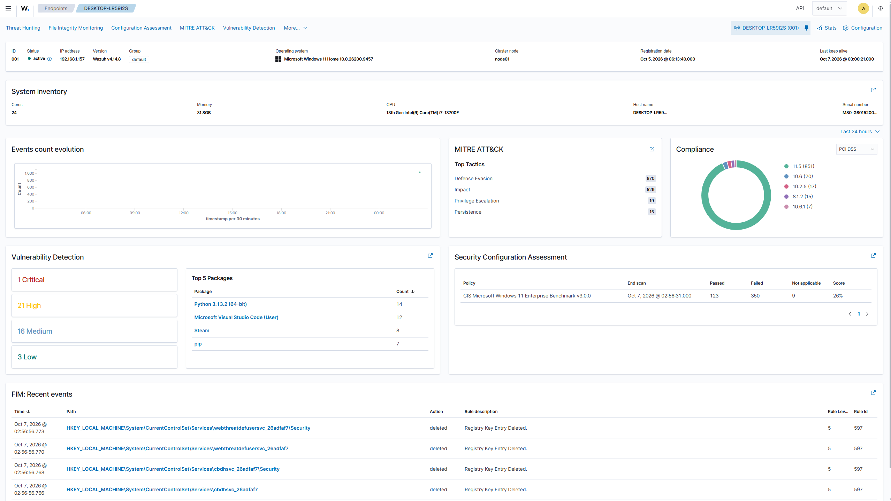
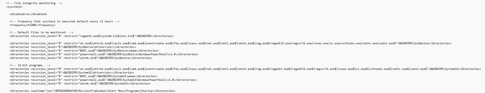
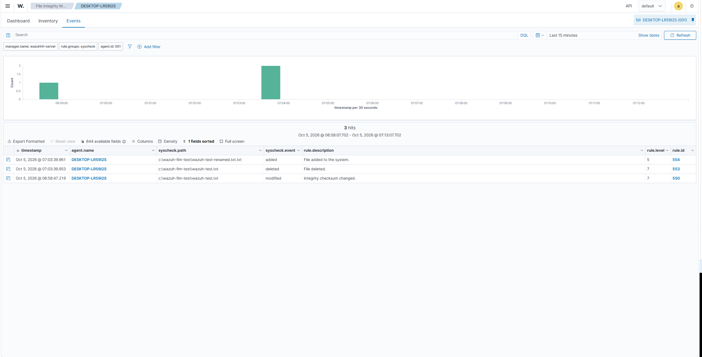

# SOC Analyst Home Lab

Hands-on SOC analyst home lab focused on security monitoring, endpoint telemetry, File Integrity Monitoring (FIM), security alert analysis, and incident investigation using Wazuh.

## Project Overview

Built a virtualized security monitoring environment using Wazuh, Ubuntu Server, Windows, and VirtualBox.

The lab simulates core SOC analyst activities by connecting a Windows endpoint to a Wazuh Manager, collecting endpoint security telemetry, monitoring file activity, generating security alerts, and investigating detected events through the Wazuh Dashboard.

## Lab Environment

- **Security Monitoring:** Wazuh
- **Server:** Ubuntu Server
- **Endpoint:** Windows
- **Virtualization:** VirtualBox
- **Monitoring:** File Integrity Monitoring (FIM)

## Key Activities

- Deployed and configured a Wazuh Manager on Ubuntu Server
- Connected and configured a Windows endpoint using the Wazuh agent
- Troubleshot endpoint communication and network connectivity
- Configured File Integrity Monitoring to detect endpoint file activity
- Generated controlled file creation, modification, and deletion events
- Analyzed security alerts through the Wazuh Dashboard
- Investigated alert severity, detection rules, timestamps, and affected files
- Documented findings and the overall security monitoring workflow

## Detection Results

| Detected Activity | Wazuh Rule | Severity |
|---|---:|---:|
| File Created | 554 | 5 |
| File Modified | 550 | 7 |
| File Deleted | 553 | 7 |

These detections demonstrate how endpoint activity can be collected, monitored, and investigated through a centralized security monitoring platform.

## SOC Skills Demonstrated

**Security Monitoring · Log Analysis · Alert Investigation · Endpoint Monitoring · File Integrity Monitoring · Incident Investigation · Linux Administration · Windows Administration · Network Troubleshooting · Technical Documentation**

## Documentation

**[View Full SOC Lab Documentation](docs/SOC-Lab-Documentation.md)**

## Lab Evidence

### Wazuh Agent Status

The Windows endpoint was successfully connected to the Wazuh Manager and actively reporting endpoint telemetry.

### Wazuh FIM Configuration

The Windows Wazuh agent was configured to monitor Windows system locations and the Startup directory for file activity, with real-time monitoring enabled for the Startup directory.

### Wazuh Security Alerts

The Wazuh Dashboard captured the file activity generated during testing, including file creation, modification, and deletion events.

## Project Outcome

Successfully built and tested an end-to-end security monitoring environment capable of collecting Windows endpoint telemetry and generating actionable alerts from monitored file activity.

The project provided hands-on experience with the SOC workflow:

**Monitor → Detect → Investigate → Document**
